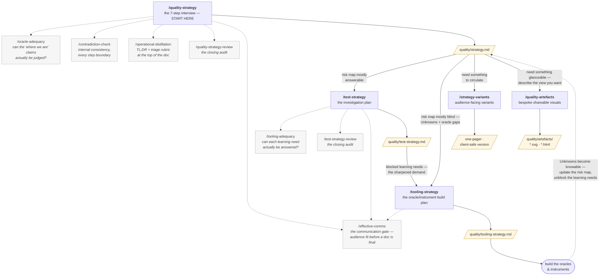

# Quality Strategy Skills

Claude Code skills that interview you to produce a software *quality strategy* — who matters for your project, what they value, where you're exposed, and what to do about it — plus the *test strategy* and *tooling strategy* that turn it into action. When most of your code is written by agents who don't know what quality means for *your* project, an explicit strategy is what stops them shipping confidently in the wrong direction.

Grounded in [**Edmund Pringle's quality framework**](https://github.com/tollens-ai/quality-assistant-prototype-03/tree/main/quality-brain): quality is value to someone who matters; testing is investigation to find out what's actually true; risk is danger to quality. For solo developers, small teams, engineering leaders — and anyone whose codebase agents now work in. You don't need a repo: running it at the idea stage is a first-class use.

> **Status: alpha.** Shared with a first wave of testers. The skills work and have been exercised hard against simulated users, but real-world mileage is limited. Expect rough edges, tell us where it misfires ([Feedback](#feedback)), and read [Known limitations](#known-limitations) first — we're not hiding the gaps.

## Install

This is a Claude Code plugin:

```
/plugin marketplace add tollens-ai/quality-strategy-skills
/plugin install quality-strategy@tollens
```

This pack depends on the companion **[`effective-comms`](https://github.com/tollens-ai/effective-comms-skills)** plugin — the shared communication gate the strategy skills run before a document is final. It is declared as a dependency and installed automatically from the same `tollens` marketplace; you don't add a second marketplace or install it by hand.

Then, in any project, start with `/quality-strategy`. Output goes to `quality/strategy.md` at the project root. (Skills are also available namespaced, e.g. `/quality-strategy:test-strategy`, if a bare name ever collides with another plugin.)

New versions ship regularly — run `claude plugin update quality-strategy@tollens` to pick them up; [CHANGELOG.md](CHANGELOG.md) says what changed.

## If you're trying it in alpha

The most useful thing you can do is run `/quality-strategy` on a real project and tell us what happened:

- **Report a misfire publicly:** open a [GitHub issue](https://github.com/tollens-ai/quality-strategy-skills/issues) with what you ran, what it produced, and what you expected instead. If you're happy to share the generated `quality/strategy.md`, attach or paste a redacted copy there.
- **Share privately:** [join the Tollens mailing list](https://tollens.ai/) and reply through the contact details you receive there.
- **Tell us where it would land:** who would read the strategy, what meeting or process it would enter, what decision it would change, and what would make it hard to use.
- **Show the artefacts:** if the strategy gives you a useful visual, summary, or one-pager, share that too — those outputs are part of what we're testing.
- **Using this with a real team?** We're looking for a small number of design partners building software where quality really matters. Join the mailing list and tell us what you're building.
- **Want to support the project?** Star the repo and share the artefacts that helped you explain your project's quality risks.

## The typical flow

1. **`/quality-strategy`** — the main event. A structured interview produces `quality/strategy.md`, ends with a built-in audit, and points you at the follow-ons.
2. **`/test-strategy`** — turns the strategy into an investigation plan: what to find out, in what order, split between humans and agents.
3. **`/tooling-strategy`** — when the docs surfaced things you can't measure or judge yet (common, and a finding rather than a failure): a prioritised build plan for the missing **oracles** (ways to judge whether something is good) and **instruments** (ways to observe what's actually happening). Steps 2 and 3 swap when the risk map comes out mostly blind — the skills recommend the order themselves; you can always overrule.
4. **`/strategy-variants`** (optional) — a one-pager or client-safe version to circulate.
5. **`/quality-artefacts`** (optional) — describe the view you want ("a tweetable summary of where quality stands", "a dashboard of the payment risks for my standup") and it designs a bespoke, self-contained SVG/HTML artefact from your strategy — honest about Unknowns, built to be screenshotted and shared. Worked examples in [`examples/fernly/quality/artefacts/`](examples/fernly/quality/artefacts/).

## How the skills fit together

Five skills you start (bold); the rest are checks and audits the strategies invoke for you as they run (dotted arrows — each also works standalone). Per-skill details: **[docs/SKILLS.md](docs/SKILLS.md)**.



The shape follows the pack's four questions — *what does good look like? how do we know? is it good? how do we make it good?* — and one rule: **you can only investigate what you can judge**, so the state of your risk map decides whether the investigation plan or the build plan comes first.

## What to expect

- **They interview you.** Your quality strategy can't be inferred from your code — who matters, what they value, what's a non-goal would all be guessed wrongly. The skills pre-read the repo to ask informed questions; everything load-bearing is asked, not assumed.
- **They hold the bar.** They won't skip your non-goals or lower rigour because a job feels small — that refusal is the point. They will adapt their phrasing to you, and offer a clearly-labelled starting guess when you're stuck.
- **They produce living documents**, meant to be read, updated, and used at decision points — not written once and filed.
- **It takes real thinking.** Plan for one to two working days of cognitive time, spread across several sessions — the skills are designed for breaks and resume cleanly. Faster than a couple of hours usually means answering too quickly.
- **No repo needed.** At the idea stage the pre-read honestly says it's interview-derived instead of dressing up guesses as scan results, and the interview carries the load it always carries.

## Known limitations

- **No dedicated dimensions yet for AI / non-deterministic products** — systems whose "correctness" is a metric distribution that drifts. The stakeholder/risk/planning machinery still helps; the "what does good look like and how would we know" core you'd hand-craft. Our top research item ([ROADMAP.md](ROADMAP.md)).
- **Validated mostly in simulation.** Stress-tested against many simulated users and reviewed adversarially; limited real-world mileage. Provisional calls are recorded in `OPEN-QUESTIONS.md` with what would change our minds.
- **`/tooling-strategy` is the newest skill** with the least mileage — expect rougher edges there.
- **Cadence is one-size.** Every run gets the same thorough treatment regardless of project size; a lighter *view* of the same rigour is on the roadmap, a lower bar is not.
- **Single-release depth.** Deep analysis covers one release at a time; re-run in revision mode when the next release's context is real.

## Where this comes from

This is the first open-source release from **Tollens** — an engineering management consultant that turns the tacit sense of *what "good" means for your project, and how good you actually are* into an explicit, living map that people and AI agents can both reason from. The pack is a working taster, standalone, no account needed — but it's **standalone skills, not an end-to-end workflow**: fitting the documents into your team's process is on you. The full Tollens product (in development) is the end-to-end version — agents supporting every step, feedback loops, evidence and reporting, release-confidence assessment.

Put simply: **this pack is the map with the you-are-here arrow. Tollens is the satnav** — turn-by-turn for the whole journey, recalculating when you drift, with an ETA you can trust.

## What's where

- **[docs/SKILLS.md](docs/SKILLS.md)** — per-skill reference, including planned skills.
- **[ROADMAP.md](ROADMAP.md)** — what's next (headline: quality dimensions for AI / non-deterministic products).
- **`examples/fernly/`** — a complete worked sample on a fictional project: full strategy, test strategy, and three generated artefacts. One project's answers, **not a template** — see [its README](examples/fernly/README.md).
- **`PHILOSOPHY.md`** — the spine; why the skills do what they do.
- **`OPEN-QUESTIONS.md`** — design decisions made under uncertainty, and what would change our minds.
- **`skills/`** — the skills themselves.

## Feedback

Tell us where it misfires: **[open an issue](https://github.com/tollens-ai/quality-strategy-skills/issues)**. The most valuable reports are concrete — what you ran, what it produced, what you expected instead. Especially wanted: dimensions the interview missed (or surfaced needlessly), places it inferred what it should have asked, and any [known limitation](#known-limitations) biting harder than described.

## Credits

The quality framework is by **Edmund Pringle**, distilled into an open-source **[quality brain](https://github.com/tollens-ai/quality-assistant-prototype-03/tree/main/quality-brain)** that this pack draws on directly; his [blog series](https://epkconsulting.substack.com/) is the best narrative read on the subject. The framework draws on the context-driven testing tradition (Bach, Bolton, Weinberg). Skills implementation by **Yanqing Cheng**. Built with Claude Code.

## License

Licensed under either of [MIT](LICENSE-MIT) or [Apache-2.0](LICENSE-APACHE) at your option. Unless you explicitly state otherwise, any contribution intentionally submitted for inclusion in this work by you, as defined in the Apache-2.0 license, shall be dual licensed as above, without any additional terms or conditions.
