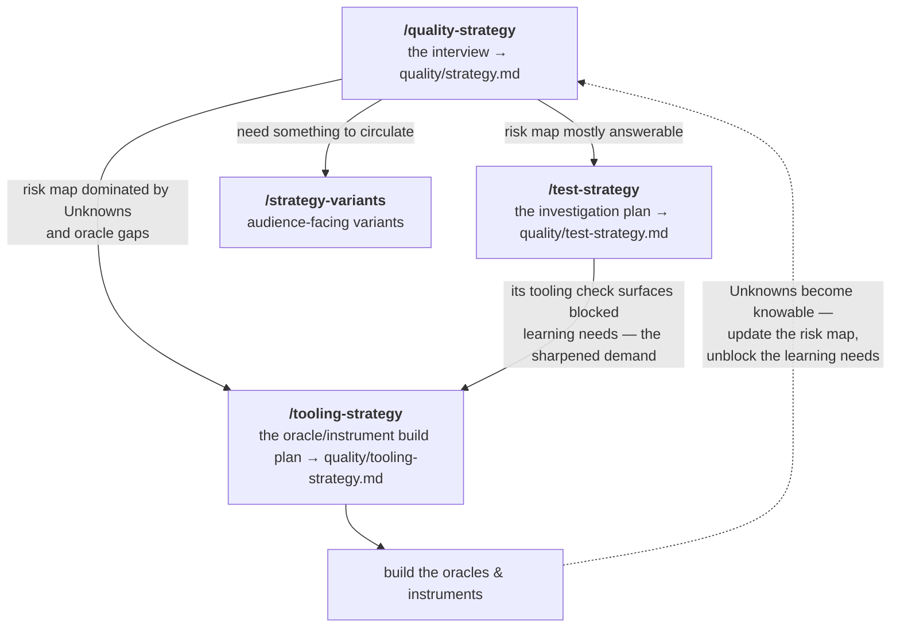

# Quality Strategy Skills

A set of Claude Code skills for producing and using a software *quality strategy* — a business-level document that says who matters for your project, what they value, where you're exposed, and what to do about it. Plus the engineering-level *test strategy* that operationalises it.

The thinking is grounded in [**Edmund Pringle's quality framework**](https://github.com/tollens-ai/quality-assistant-prototype-03/tree/main/quality-brain): quality is value to someone who matters; testing is investigation to find out what's actually true; risk is danger to quality; the job is to maximise quality improvement for the time invested.

> **Status: alpha.** This pack is being shared with a first wave of testers. The skills are working and have been exercised across a wide range of simulated users, but they have had limited real-world mileage. Expect rough edges, tell us where it misfires (see [Feedback](#feedback)), and read [Known limitations](#known-limitations) before you start — there are gaps we already know about and are not hiding.

## Why this exists

Most teams don't have a quality strategy. The teams that do mostly have a test plan misnamed. We think a real quality strategy is load-bearing infrastructure for software in the age of AI agents — when most code is being written by agents who don't know what quality means for *your* project, an explicit strategy is what stops them shipping confidently in the wrong direction.

Writing a quality strategy is just the start. Delivering the right quality for your product over time is an ongoing process, and a much bigger one — involving testing, measurement, stakeholder conversations, and the cumulative judgment of everyone shipping the software. This skill pack covers the front end of that work: producing the strategy, operationalising it as a test strategy, and using it at decision points. It's intentionally minimal — markdown skills, no daemon, no database, no binary to install.

## Where this comes from

Quality Strategy Skills is the first open-source release from **Tollens**. Tollens is an engineering management consultant for building genuinely good software and making good engineering decisions — it helps you externalise the usually-tacit sense of *what "good" means for your project, and how good you actually are*, into an explicit, living map that both people and AI agents can reason from.

Producing a quality strategy — who matters, what they value, where you're exposed, and what to do about it — is the front of that work. This pack is the part of Tollens you can pick up and use today, standalone, with no account and no dependency on the rest. The wider Tollens product is in development.

## Who it's for

- Solo developers and small teams who want a quality strategy but don't want to read a textbook to make one.
- Anyone running AI agents who needs the agents to make quality calls without escalating every decision.
- Engineering leaders who want a structured framework for what "good" looks like.
- People at the **idea stage** — you do not need a repo. Running this before you write code is a first-class use (see [no-repo](#running-without-a-repo)).

## The skills — and how they fit together

Ten skills ship in the pack, but you only ever *start* four of them. The pack is a tree: one main interview, three follow-ons that each elaborate a slice of its output, and a set of sub-skills the strategies invoke for you as they run (each also works standalone when you want one check on its own).

```
/quality-strategy ················ START HERE — the interview → quality/strategy.md
│
│  invokes for you as it runs:
│    /oracle-adequacy ············ "how do we know?" audit — can the risk map's
│    │                              where-we-are claims actually be trusted?
│    /contradiction-check ········ internal-consistency check at every step boundary
│    /operational-distillation ··· TL;DR + triage rubric at the top of the finished doc
│    /quality-strategy-review ···· the closing audit
│
├─▶ /test-strategy ··············· follow-on: the investigation plan
│   │                              → quality/test-strategy.md
│   │  invokes for you:
│   │    /tooling-adequacy ······· "how do we know?" audit — can each learning
│   │                              need actually be answered?
│   └──  /test-strategy-review ··· the closing audit
│
├─▶ /tooling-strategy ············ follow-on: the oracle/instrument build plan
│                                  → quality/tooling-strategy.md
│
└─▶ /strategy-variants ··········· follow-on: audience-facing variants
                                   (one-pager, client-safe version)
```

The shape follows the four questions the pack is built on — *what does good look like? how do we know? is it good? how do we make it good?* — and one deliberate design rule: the strategy's plan of work (Part 7) is a **sketch** — optional, and skippable outright in favour of the follow-ons — and the follow-ons elaborate it. `/test-strategy` takes the testing work and turns it into an investigation plan. `/tooling-strategy` takes everything the other two docs *couldn't* answer — Unknowns, dimensions gated on missing oracles, learning needs blocked on missing instruments — and turns it into a prioritised build plan. `/strategy-variants` takes the finished strategy and reshapes it for an audience.

### Which order? Let the risk map decide

The follow-ons are a flow, not a fixed sequence. The principle: **you can only investigate what you can judge** — so the state of your risk map decides whether the build plan or the investigation plan comes first, and the adequacy checks are the fork points.



A project that's mostly measurable goes interview → investigation plan, with the build plan mopping up the gaps afterwards. A project that's mostly *blind* — lots of "we genuinely can't tell" in the risk map — goes interview → build plan first, because an investigation plan written against unjudgeable dimensions is mostly "blocked". The skills recommend the branch themselves at each hand-off; you can always overrule.

### Skills you run directly

| Skill | Purpose |
|---|---|
| `/quality-strategy` | Walk a 7-step interview to produce `quality/strategy.md`. Use when starting a project, planning a major release, or when "quality" is being talked about vaguely. |
| `/test-strategy` | Produce the engineering-level companion that operationalises the quality strategy — what to investigate, in what order, and how to split human vs agent effort. |
| `/tooling-strategy` | The strategy for "how do we know?". Gathers everything the quality and test strategies couldn't answer — Unknown/Gated/over-confident actuals, learning needs blocked on missing instruments or oracles — into one prioritised oracle/instrument build plan. Run it as soon as unanswerables exist: directly after `/quality-strategy` when the risk map is mostly blind, after `/test-strategy` when it's mostly answerable. The most re-runnable of the three. |
| `/strategy-variants` | Post-processing. From a finished, reviewed `quality/strategy.md`, derive audience-facing variants without touching the original: a distributable one-pager and a client-safe ("polite") version. Omits and re-pitches; never asserts quality the strategy doesn't support. |

### Sub-skills (invoked for you; each also runs standalone)

| Skill | Purpose |
|---|---|
| `/quality-strategy-review` | Meta-audit. Applies seven indicators of a good quality strategy — org-wide clarity, instrumentation from the start, a legible work plan, precision over comfort, decision support at the edges, quick re-orientation, and explicit non-goals — and surfaces failure modes. Final step of `/quality-strategy`; also standalone on existing strategies. |
| `/test-strategy-review` | Meta-audit of a test strategy: would executing it move the quality strategy in the right direction, with the right priority? |
| `/oracle-adequacy` | The "how do we know?" check for the *quality* strategy — audits the oracles behind its actual-state assessments. Invoked during the risk-map pass, or standalone. Shares its oracle taxonomy with `/tooling-adequacy`. |
| `/tooling-adequacy` | The "how do we know?" check for the *test* strategy. Audits whether each learning need has an adequate *instrument* (to exercise/observe) and *oracle* (to judge), including cheap simulated/reference oracles worth building. |
| `/contradiction-check` | Cross-part contradiction detection for a strategy doc. Runs at `/quality-strategy` step boundaries, or standalone. Finds internal inconsistencies (not quality weaknesses). |
| `/operational-distillation` | TL;DR + triage rubric at the top of a strategy, so it's usable at a glance. Runs at the end of `/quality-strategy`, or standalone. |

Planned (not yet implemented):

| Skill | Purpose |
|---|---|
| `/tooling-strategy-review` | Meta-audit of a tooling strategy, completing the strategy/review pairing the other two strategies have. |
| `/priority-analysis` | Optional multi-stakeholder help prioritising the plan of work. |
| `/feedback-synthesis` | Curate the notes the skills jot down about their own rough edges as you run (a `.skill-feedback.md` file at the project root) into a maintainer-friendly summary. |
| `/pre-read` | Standalone project digest. |

## Install

This is a Claude Code plugin. Add the marketplace, then install:

```
/plugin marketplace add tollens-ai/quality-strategy-skills
/plugin install quality-strategy@tollens
```

Then in any project, start with `/quality-strategy`. Output goes to `quality/strategy.md` at the project root.

Skills are also available namespaced (`/quality-strategy:test-strategy`, `/quality-strategy:quality-strategy-review`) — useful if a bare name ever collides with another plugin.

## Quickstart — the typical flow

1. **`/quality-strategy`** — the main event. A structured interview produces `quality/strategy.md`. It ends by running `/operational-distillation` (a TL;DR + triage rubric at the top) and `/quality-strategy-review` (the audit), and then points you at the follow-ons.
2. **`/test-strategy`** — turns the strategy into an engineering plan: what to investigate, in what order, and how to split human vs agent effort. Ends with `/test-strategy-review`.
3. **`/tooling-strategy`** (when the docs surfaced things you can't measure or judge yet — common, and a finding rather than a failure) — turns those gaps into a prioritised oracle/instrument build plan. Steps 2 and 3 swap when the risk map comes out mostly blind — see [Which order?](#which-order-let-the-risk-map-decide).
4. **`/strategy-variants`** (optional) — when you need something to circulate to the team or show a client, derive a one-pager or a client-safe version from the finished strategy.

You can also run any of the review/check skills (`/quality-strategy-review`, `/contradiction-check`, `/oracle-adequacy`, `/tooling-adequacy`, `/operational-distillation`) standalone against an existing strategy doc.

## What the skills will and won't do

**They interview you.** They do not infer your quality strategy from your code. The most important inputs — who matters, what they value, what's a non-goal, where you'll accept risk — cannot be guessed from a repo and would be guessed wrongly. The skills pre-read README, docs, and recent commits (when a repo exists) to bring informed questions to the conversation, but everything load-bearing is asked, not assumed.

**They are facilitators, not authors.** The skills walk a structured process and push back when something is missing or vague. They don't replace your judgment.

**They produce a living document.** `quality/strategy.md` is meant to be read, updated, and used at decision points — not written once and filed.

**They hold the bar.** The skills will not skip your non-goals, collapse the dimension passes, or lower rigour because a job feels small — that refusal is the point. They *will* adapt how questions are phrased to you, and (when you're genuinely stuck) offer a clearly-labelled starting guess for you to push against. They will not present a guess as established fact.

### Running without a repo

You do not need a codebase to run `/quality-strategy`. Running it at the idea stage — before any code exists — is a first-class, supported use: a quality strategy is most valuable *before* the build, when it can still steer it. With no repo, the pre-read degrades honestly (it says it's interview-derived rather than dressing up guesses as scan results), and the interview carries the load it always carries. The only thing a missing repo costs is the pre-read's scan-derived hypotheses; everything load-bearing was always going to be asked, not read.

## Known limitations

This is an alpha. Be aware of these before you rely on it:

- **No dedicated quality dimensions yet for AI / non-deterministic / agentic products.** The dimension framework is strong for conventional software, but it does **not** yet have worked dimensions for systems whose "correctness" is a *metric distribution with a tolerance* rather than a green/red test, nor a built-in mechanism for **non-stationary** quality that drifts over time (model/data drift, prompt-sensitivity, eval-harness adequacy). If you're building an ML pipeline, a recommender, an LLM app, or another non-deterministic/agentic product, the skill will still help with stakeholders, non-goals, risk, and plan-of-work, but you will have to hand-craft the "what does good look like and how would we know" part for the non-deterministic core. Closing this gap is our top research item (see [Roadmap](#roadmap--future-work)).
- **No-repo caveats.** Running without a repo is supported, but the pre-read can only surface what you tell it — it can't catch a contradiction between your stated intent and code that doesn't exist yet. Treat a no-repo strategy as a pre-implementation plan to revisit once there's something to scan.
- **Validated mostly in simulation so far.** The skills have been stress-tested against many simulated users and reviewed adversarially, but real-world mileage is still limited. Some calls are explicitly provisional — see `OPEN-QUESTIONS.md`, which records design decisions made under uncertainty along with what would change our minds.
- **`/tooling-strategy` is the newest skill** and has the least mileage in the pack. Its inputs and outputs are stable (it consumes the build items the two adequacy audits already produce), but expect rougher edges there than in `/quality-strategy`.
- **Cadence is one-size.** Every run applies the same thorough cadence regardless of project size. That's deliberate (we'd rather not lower the bar by accident), but an expert on a small job may find the ceremony heavier than they'd like. A "lean/velocity" view of the same rigour is on the roadmap, not yet built.
- **Internal decomposition is partial.** The skill's sealed-context dispatch + scratch-file auditability is in place for the analytical steps that have been decomposed (pre-read, dimension scout, dimension rating, oracle adequacy, contradiction checks, distillation); the remaining sub-steps are still run inline by the orchestrator. This is tracked, not hidden (`OPEN-QUESTIONS.md`).
- **Single-release depth.** The deep analysis is for one release at a time; future releases get light notes and a re-run in revision mode when their context is real.

## Roadmap — future work

In rough priority order. These are tracked in `OPEN-QUESTIONS.md` with the reasoning and falsification conditions for each.

- **Quality dimensions for new-world (AI / non-deterministic / agentic) products** *(research, top priority)* — go back to the research stage and work out what quality dimensions exist for products whose quality is non-deterministic and drifts: metric-distribution "correctness", drift/time-awareness, eval-oracle adequacy, training/serving skew. Many users build exactly these products; the framework needs first-class dimensions for them, not a conventional-software workaround.
- **Cadence / "lean-mode" investigation** — the open question is whether the 21 sub-steps surface dimensions that genuinely matter for every project or some are spurious for smaller ones. The answer decides whether "lean mode" means a lighter *view* of the same rigour, or nothing at all. We are probing this in validation runs before designing anything — we will not ship a mode that quietly lowers the bar.
- **Per-stakeholder risk-map decomposition** — the dimension-rating step already runs per-stakeholder and surfaces cross-stakeholder divergence; the risk map (required/actual/gap, sub-steps 6.x) does not yet. Bringing the same per-stakeholder-then-merge treatment to the risk map is a definite to-do (it interacts with the cadence work, so it's sequenced after it).
- **`/strategy-variants` field-hardening** — the one-pager / client-safe transformation shipped in this alpha; real client/team use will tell us whether the omit-never-lie discipline holds and whether a sharper "degrade to one move when funding-constrained" element is needed.

## How long does it take?

Plan for **one to two working days** of real thinking — not elapsed time, but cognitive time. A serious quality strategy is exhausting work. The interview surfaces decisions you've been avoiding, contradictions you didn't know you were carrying, and stakeholder questions you can't answer off the top of your head. You can't plough through it in one sitting and produce anything honest.

Expect to spread it across **several sessions** of 60–90 minutes each, with `/clear` between, ideally across multiple days. The skill is designed for that — sub-steps are durable across interruptions, and natural break points are flagged. If yours takes a day or longer, that's a sign real thinking is happening. If it takes less than a couple of hours total, you've probably been answering too quickly.

## What's where

- `PHILOSOPHY.md` — the spine. Read this if you want to understand why the skills do what they do.
- `OPEN-QUESTIONS.md` — design decisions made under uncertainty, places we're not sure we got it right, things to test in real-world running. The durable record of *why* the skills are shaped as they are.
- `skills/` — the skills themselves. Each is a directory with a `SKILL.md` orchestrator and, where the work warrants it, a `steps/` directory with one file per phase.

## Feedback

This is an alpha and the most useful thing you can do is tell us where it misfires. Open an issue: **[github.com/tollens-ai/quality-strategy-skills/issues](https://github.com/tollens-ai/quality-strategy-skills/issues)**.

The most valuable reports are concrete: what you ran, what it produced, and what you expected instead. Especially wanted —

- a dimension the interview missed for your project, or one it surfaced that didn't matter;
- a place the facilitator inferred something it should have asked, or asked something it should have known;
- anything in [Known limitations](#known-limitations) biting harder than described — particularly the AI / non-deterministic-product gap, which is our top research item.

## Credits

The quality framework is by **Edmund Pringle**, distilled into an open-source **[quality brain](https://github.com/tollens-ai/quality-assistant-prototype-03/tree/main/quality-brain)** — quality attributes, heuristics, and stakeholder models — that this pack draws on directly. His blog series at [epkconsulting.substack.com](https://epkconsulting.substack.com/) is the best narrative read on the subject. The framework draws on the context-driven testing tradition (Bach, Bolton, Weinberg).

Skills implementation by **Yanqing Cheng**. Built with Claude Code.

## License

Licensed under either of:

- MIT License ([LICENSE-MIT](LICENSE-MIT))
- Apache License, Version 2.0 ([LICENSE-APACHE](LICENSE-APACHE))

at your option.

Unless you explicitly state otherwise, any contribution intentionally submitted for inclusion in this work by you, as defined in the Apache-2.0 license, shall be dual licensed as above, without any additional terms or conditions.
